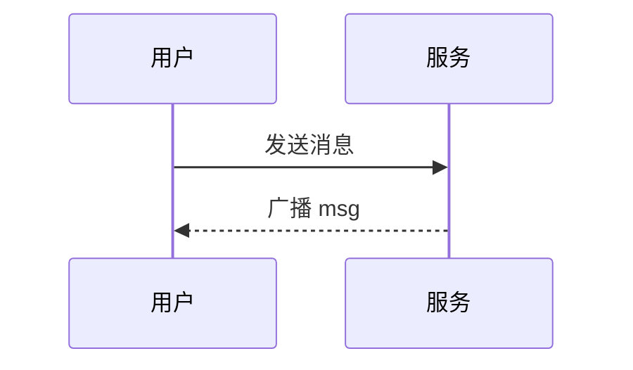

# 消息格式与富文本

CircleChat 的文本消息默认按富文本渲染，支持 Markdown、代码高亮、数学公式和流程图。更完整的收发机制见 [用户指南](../guide/usage)。

当前支持的能力：**Markdown**（CommonMark 风格）、**代码高亮**（三反引号 + 语言）、**数学公式**（行内 `$`、块级 `$$`，MathJax 客户端渲染）、**流程图 / 时序图**（` ```mermaid `）、**引用回复**、**合并转发**（`merge` 类型），以及文本、图片、文件、视频、音频等多种消息类型（含各自上限）。

## Markdown

文本消息按 CommonMark 风格渲染，常用写法如下，发消息时直接写即可，无需额外开启模式。

- **加粗**：`**文字**`
- **斜体**：`*文字*`
- **删除线**：`~~文字~~`

```text
这是 **加粗** 文字。
这是 *斜体* 文字。
这是 ~~删除线~~ 文字。
```

- **标题**：`#`、`##`、`###`

```text
# 一级标题
## 二级标题
### 三级标题
```

- **无序列表**与**有序列表**：

```text
- 第一项
- 第二项
- 第三项
```

```text
1. 第一项
2. 第二项
3. 第三项
```

- **链接**：`[文字](https://example.com)`
- **行内代码**：`` `code` ``

```text
请参考 [用户指南](../guide/usage)。
运行 `npm run typecheck` 可以执行类型检查。
```

- **引用**：`>`
- **分割线**：`---`
- **表格**：支持，适用于整理对比信息、参数说明、类型一览、上限汇总等。

## 代码高亮

用三个反引号包裹代码并标注语言即可高亮：

````text
```ts
function add(a: number, b: number) {
  return a + b
}
```
````

- 高亮用 [highlight.js](https://github.com/highlightjs/highlight.js)，本地自托管于 `public/vendor/highlight.min.js`，包含约 35 种常见语言，不经过外部 CDN。
- 该文件缺失时前端自动降级成纯文本，不会报错。
- 不标语言时按自动识别或纯文本展示。
- 建议标注语言：`ts` / `js` / `json` / `bash` / `text` 等。

## 数学公式（MathJax）

由 MathJax 在客户端渲染。

- **行内公式**：单个 `$` 包裹

```text
质能方程 $E=mc^2$ 是狭义相对论的核心。
```

- **块级公式**：`$$` 包裹

```text
$$
\int_{-\infty}^{\infty} e^{-x^2}\,dx = \sqrt{\pi}
$$
```

## 流程图 / 时序图（Mermaid）

用 ` ```mermaid ` 代码块写 Mermaid 图表，客户端渲染成图：

````text

````

支持 Mermaid 常见图类型（流程图、时序图、类图等）。运行环境不支持某个图类型时，会回退成代码块展示源码，内容不丢失。

## 引用回复

右键 / 长按一条消息选「引用回复」，发送时带上原消息引用，其他人能看到你回复的是哪条、原内容是什么。服务端会校验引用必须同房间且未撤回。

## 合并转发

多选多条消息后可「合并转发」成一条 `merge` 类型消息，双方点开能在查看器里看到原始多条内容。不是简单拼接成长文本。上限为 **100 条 / 8000 字符**，超过会被拒。

## 消息类型一览

| 类型 | 说明 | 上限 |
| --- | --- | --- |
| `text` | 文本（支持上述富文本） | 4096 字符 |
| `image` | 图片（魔数校验） | 单文件 100MB |
| `file` | 文件 | 单文件 100MB |
| `video` | 视频 | 单文件 100MB |
| `audio` | 音频 | 单文件 100MB |
| `merge` | 合并转发（结构化 JSON） | 100 条 / 8000 字符 |

- `text`：支持 Markdown、代码高亮、数学公式、Mermaid、引用回复、合并转发中的文本，上限 4096 字符。
- `image`：魔数校验（检查文件实际类型而非扩展名），单文件 100MB。
- `file` / `video` / `audio`：单文件 100MB。
- `merge`：结构化 JSON，上限 100 条 / 8000 字符。

## 格式速查表

| 功能 | 写法 |
| --- | --- |
| 加粗 | `**文字**` |
| 斜体 | `*文字*` |
| 删除线 | `~~文字~~` |
| 一级标题 | `#` |
| 二级标题 | `##` |
| 三级标题 | `###` |
| 无序列表 | `-` |
| 有序列表 | `1.` |
| 链接 | `[文字](https://example.com)` |
| 行内代码 | `` `code` `` |
| 引用 | `>` |
| 分割线 | `---` |
| 表格 | 支持 |

| 功能 | 写法 / 说明 |
| --- | --- |
| 代码块 | 三个反引号包裹 |
| 标注语言 | 开始反引号后写语言，如 `ts` |
| 不标语言 | 自动识别或纯文本展示 |
| 高亮库 | highlight.js；本地 `public/vendor/highlight.min.js`；约 35 种常见语言；不走外部 CDN |
| 文件缺失 | 自动降级纯文本，不报错 |
| 行内公式 | 单个 `$` 包裹 |
| 块级公式 | `$$` 包裹 |
| 公式渲染 | MathJax，客户端 |
| 图表代码块 | ` ```mermaid ` |
| Mermaid 支持 | 流程图、时序图、类图等常见类型 |
| 不支持时 | 回退成代码块展示源码 |
| 引用回复 | 右键 / 长按消息选「引用回复」；校验必须同房间且未撤回 |
| 合并转发 | `merge` 类型；上限 100 条 / 8000 字符；超过会被拒 |

## 边界与限制汇总

- 文本消息：4096 字符。
- 图片：单文件 100MB，魔数校验。
- 文件、视频、音频：单文件 100MB。
- 合并转发：100 条 / 8000 字符，超过会被拒。
- 引用回复：必须同房间且未撤回。
- 代码高亮：本地自托管约 35 种常见语言，不走外部 CDN；文件缺失时降级纯文本，不报错；不标语言时自动识别或纯文本。
- Mermaid：客户端渲染；不支持的图类型回退成代码块源码。
- 数学公式：MathJax 客户端渲染；行内单 `$`，块级 `$$`。