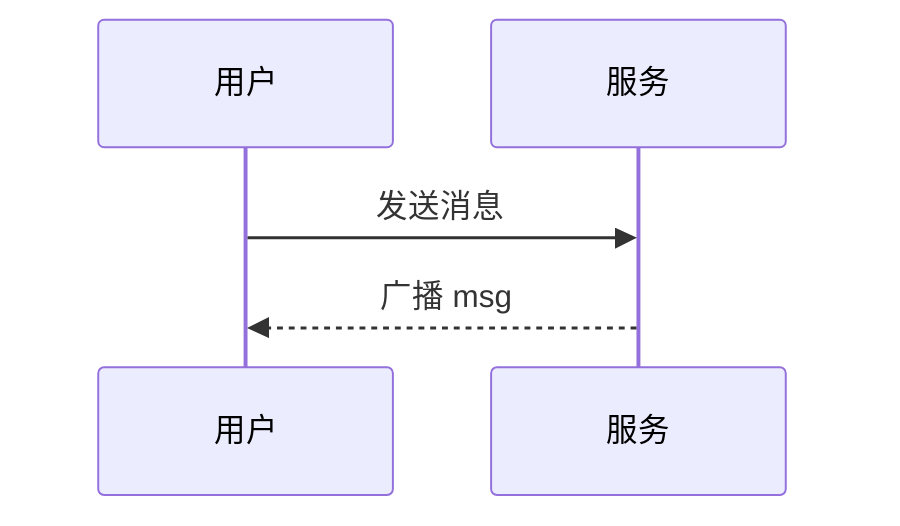

# 消息格式与富文本

CircleChat 的文本消息默认按富文本渲染，支持 Markdown、代码高亮、数学公式和流程图。这一页是给普通用户的格式速查；更完整的收发机制见 [用户指南](../guide/usage.md)。

如果你平时只是发文字、贴代码、写公式、画流程图，或者需要引用回复、合并转发，那么这一页的内容基本覆盖了日常使用中最常见的格式能力。下面按功能逐项说明：每一项都包括它是什么、怎么写、会显示成什么、适合什么场景，以及需要留意的边界。

## 一、总览：文本消息不只是纯文本

在 CircleChat 中，文本消息默认按富文本渲染。这意味着，当你发送一段文本时，它不只是原样显示字符，而是会按照一定的格式规则进行解析和展示。当前这一页列出的主要能力包括：

1. **Markdown**：文本消息按 CommonMark 风格的 Markdown 渲染，常用写法都支持。
2. **代码高亮**：用三个反引号包裹代码，并标注语言即可高亮。
3. **数学公式**：行内公式用单个 `$` 包裹，块级公式用 `$$`，由 MathJax 在客户端渲染。
4. **流程图 / 时序图**：用 ` ```mermaid ` 代码块写 Mermaid 图表，客户端渲染成图。
5. **引用回复**：右键 / 长按一条消息选「引用回复」，发送时带上原消息引用。
6. **合并转发**：多选多条消息后可「合并转发」成一条 `merge` 类型消息。
7. **多种消息类型**：文本、图片、文件、视频、音频、合并转发，各自有不同说明和上限。

这些能力共同构成了 CircleChat 的消息格式体系。对于普通用户来说，不需要理解底层实现，只需要记住常用写法；对于需要贴代码、写推导、画流程的用户来说，这些格式能显著提升表达效率。

## 二、Markdown

文本消息按 CommonMark 风格的 Markdown 渲染，常用写法都支持。也就是说，你不需要额外开启某个模式，直接在文本消息里写 Markdown 语法，发送后就会按相应格式展示。

下面逐项说明这一页列出的常用写法。

### 1. 加粗、斜体、删除线

- **加粗**：`**文字**`
- **斜体**：`*文字*`
- **删除线**：`~~文字~~`

示例：

```text
这是 **加粗** 文字。
这是 *斜体* 文字。
这是 ~~删除线~~ 文字。
```

显示效果可以理解为：

- “加粗”会以加粗形式呈现；
- “斜体”会以斜体形式呈现；
- “删除线”会在文字上显示删除线。

这三种是最常用的行内格式。适合强调关键词、表达语气、标记已经失效或修改的内容。

### 2. 标题

标题写法：

- `#`
- `##`
- `###`

示例：

```text
# 一级标题
## 二级标题
### 三级标题
```

这一页列出的标题层级是 `#`、`##`、`###`。在消息中使用标题，可以让长内容更有层次，例如：

- 用 `#` 写主题；
- 用 `##` 写分节；
- 用 `###` 写小节。

如果你要发一段较长的说明、整理一份清单、写一篇短公告，标题可以让阅读者更快抓住结构。

### 3. 无序列表与有序列表

无序列表写法：

```text
- 第一项
- 第二项
- 第三项
```

有序列表写法：

```text
1. 第一项
2. 第二项
3. 第三项
```

无序列表适合并列信息，例如功能点、注意事项、材料清单。有序列表适合步骤、排名、顺序说明，例如操作流程、优先级、执行顺序。

### 4. 链接与行内代码

链接写法：

```text
[文字](https://example.com)
```

行内代码写法：

```text
`code`
```

链接适合引用网页、文档、资料地址。行内代码适合在句子中嵌入短代码、命令、变量名、文件名、参数名等。

例如：

```text
请参考 [用户指南](../guide/usage.md)。
运行 `npm run typecheck` 可以执行类型检查。
```

行内代码的好处是，它会把内容标识为代码样式，和普通正文区分开，阅读时更容易识别。

### 5. 引用、分割线、表格

这一页列出的还有：

- 引用：`>`
- 分割线：`---`
- 表格

引用示例：

```text
> 这是一段引用内容。
```

引用适合摘录、强调、回复某段话，或者把一段内容从正文中区分出来。

分割线示例：

```text
---
```

分割线适合在长消息中分隔不同主题，让内容更有层次。

表格也在支持范围内。表格适合整理对比信息、参数说明、类型一览、上限汇总等。本文后面的“消息类型一览”本身就是一个表格示例。

### 6. Markdown 使用建议

对于普通用户，Markdown 的最大价值是：不离开文本输入框，就能表达结构。你可以用它来：

- 强调重点；
- 列出步骤；
- 整理清单；
- 引用内容；
- 插入链接；
- 插入短代码；
- 分隔段落；
- 制作简单表格。

如果你不确定某种写法是否支持，可以先按这一页列出的常用写法来写。这一页明确说“常用写法都支持”，并逐项列出了上述能力。

## 三、代码高亮

代码高亮是 CircleChat 文本消息的重要能力之一。用三个反引号包裹代码，并标注语言即可高亮。

### 1. 基本写法

示例：

````text
```ts
function add(a: number, b: number) {
  return a + b
}
```
````

在这个示例中：

- 三个反引号开始代码块；
- `ts` 表示语言是 TypeScript；
- 代码内容写在中间；
- 最后用三个反引号结束代码块。

发送后，代码会按 TypeScript 进行高亮展示。

### 2. 高亮实现

高亮用 [highlight.js](https://github.com/highlightjs/highlight.js)。CircleChat 本地自托管：

```text
public/vendor/highlight.min.js
```

其中包含约 35 种常见语言。它不经过外部 CDN。这意味着代码高亮不依赖外部 CDN 资源，而是使用本地自托管文件。

### 3. 文件缺失时的降级

如果该文件缺失，前端自动降级成纯文本，不会报错。也就是说：

- 有高亮文件时，代码按语言高亮；
- 文件缺失时，代码仍然会显示，只是以纯文本形式展示；
- 不会因为高亮文件缺失而导致页面报错。

这一点对普通用户的意义是：即使运行环境不完整，代码内容也不会丢失，仍然可读。

### 4. 不标语言时

不标语言时按自动识别或纯文本展示。也就是说，你可以只写：

````text
```
function add(a, b) {
  return a + b
}
```
````

这时前端会尝试自动识别，或者按纯文本展示。具体展示方式取决于运行环境和识别结果。

### 5. 适合贴什么代码

代码高亮适合：

- 函数片段；
- 配置示例；
- 命令片段；
- 报错信息；
- 数据结构；
- 接口示例；
- 算法实现；
- 伪代码。

如果你要贴较长代码，建议标注语言。例如：

- `ts`：TypeScript
- `js`：JavaScript
- `json`：JSON
- `bash`：Shell 命令
- `text`：纯文本

这一页给出的示例是 `ts`。其他语言是否能高亮，取决于本地自托管的 highlight.js 中包含的约 35 种常见语言。权威情况以本地文件为准。

### 6. 代码块检查清单

发送代码块前，可以检查：

- 是否用三个反引号包裹？
- 是否标注了语言？
- 语言标记是否写在开始反引号后面？
- 代码中是否包含三个反引号导致提前结束？
- 如果高亮文件缺失，是否仍能接受纯文本展示？
- 如果不标语言，是否接受自动识别或纯文本展示？

## 四、数学公式（MathJax）

数学公式由 MathJax 在客户端渲染。行内公式用单个 `$` 包裹，块级公式用 `$$`。

### 1. 行内公式

写法：

```text
质能方程 $E=mc^2$ 是狭义相对论的核心。
```

显示时，`$E=mc^2$` 会作为行内公式渲染，和正文在同一行中展示。适合在句子中插入简短公式，例如变量、符号、简单表达式。

### 2. 块级公式

写法：

```text
$$
\int_{-\infty}^{\infty} e^{-x^2}\,dx = \sqrt{\pi}
$$
```

块级公式会单独成块展示，适合较长公式、推导过程、积分、求和、矩阵等。

### 3. 适合场景

公式由 MathJax 在客户端渲染，适合贴：

- 推导；
- 统计；
- 算法复杂度；
- 数学定义；
- 物理公式；
- 工程计算；
- 教学说明。

例如：

```text
质能方程 $E=mc^2$ 是狭义相对论的核心。

$$
\int_{-\infty}^{\infty} e^{-x^2}\,dx = \sqrt{\pi}
$$
```

这段内容中，第一行包含行内公式，第二段是块级公式。发送后，客户端会分别按行内和块级方式渲染。

### 4. 使用提示

- 行内公式用单个 `$`；
- 块级公式用 `$$`；
- 公式由 MathJax 在客户端渲染；
- 适合贴推导、统计、算法复杂度等内容。

如果你要写较长推导，可以多用块级公式，让每一步单独成块，阅读更清晰。如果只是提到某个符号，可以用行内公式，让正文保持连贯。

## 五、流程图 / 时序图（Mermaid）

用 ` ```mermaid ` 代码块写 Mermaid 图表，客户端渲染成图。

### 1. 基本写法

示例：

````text

````

在这个示例中：

- 代码块语言标记为 `mermaid`；
- 内容是 Mermaid 的 `sequenceDiagram`；
- 客户端会把它渲染成时序图。

### 2. 支持范围

支持 Mermaid 的常见图类型，包括：

- 流程图；
- 时序图；
- 类图；
- 等。

也就是说，Mermaid 常见图类型都可以尝试。具体能否渲染，取决于运行环境是否支持该图类型。

### 3. 回退行为

如果运行环境不支持某个图类型，会回退成代码块展示源码。这意味着：

- 支持时，显示为图；
- 不支持时，不会丢失内容，而是展示 Mermaid 源码；
- 用户仍然可以看到原始定义。

这一点对沟通很重要：即使图表没有渲染出来，源码仍然可读，其他人可以复制到支持 Mermaid 的环境中查看。

### 4. 适合场景

Mermaid 适合：

- 流程说明；
- 交互时序；
- 系统结构；
- 类关系；
- 状态变化；
- 简单架构图。

对于普通用户来说，最常用的是流程图和时序图。时序图特别适合描述“谁先做什么、谁后做什么、消息如何传递”。示例中的“用户 -> 服务：发送消息”“服务 --> 用户：广播 msg”就是典型时序图表达。

### 5. Mermaid 检查清单

发送 Mermaid 图表前，可以检查：

- 是否使用 ` ```mermaid ` 代码块？
- 图类型是否是 Mermaid 常见类型？
- 是否接受在不支持时回退成代码块源码？
- 图表内容是否完整，便于他人复制？
- 是否避免把非 Mermaid 内容放进 `mermaid` 代码块？

## 六、引用回复

右键 / 长按一条消息选「引用回复」，发送时带上原消息引用，其他人能看到你回复的是哪条、原内容是什么。服务端会校验引用必须同房间且未撤回。

### 1. 怎么操作

- 右键一条消息；
- 或长按一条消息；
- 选择「引用回复」；
- 发送时带上原消息引用。

### 2. 其他人看到什么

其他人能看到：

- 你回复的是哪条；
- 原内容是什么。

这比单纯说“回复上面那条”更清楚，尤其在群聊、多人讨论、消息很多的情况下，引用回复能显著减少歧义。

### 3. 服务端校验

服务端会校验引用必须同房间且未撤回。也就是说：

- 引用必须来自同一个房间；
- 被引用的消息必须未撤回；
- 如果不满足条件，引用关系不会被接受。

这个规则保证了引用的有效性。你回复的必须是当前房间里仍然存在的消息。

### 4. 适合场景

引用回复适合：

- 多人同时讨论时明确回复对象；
- 对某条消息逐条回应；
- 对旧消息补充说明；
- 避免“你说的是哪条”的歧义；
- 在长对话中保持上下文。

### 5. 引用回复检查清单

- 是否选中了正确的消息？
- 是否在同一个房间内？
- 原消息是否未撤回？
- 回复内容是否与引用内容对应？
- 如果原消息被撤回，是否需要改用普通消息说明？

## 七、合并转发

多选多条消息后可「合并转发」成一条 `merge` 类型消息，对方点开能在查看器里看到原始多条内容。合并转发上限 100 条 / 8000 字符，超过会被拒。

### 1. 怎么操作

- 多选多条消息；
- 选择「合并转发」；
- 生成一条 `merge` 类型消息；
- 对方点开后，在查看器里看到原始多条内容。

### 2. 显示方式

合并转发不是把多条消息简单拼成一条长文本，而是生成一条 `merge` 类型消息。对方点开后，可以在查看器中查看原始多条内容。这种方式适合转发一段对话、一组信息、多条记录。

### 3. 上限

合并转发上限为：

- 100 条；
- 8000 字符。

超过会被拒。因此，在合并转发前，应确认选中的消息条数和总字符数没有超过上限。

### 4. 适合场景

合并转发适合：

- 把一段讨论转给其他人；
- 把多条相关信息打包发送；
- 保留原始多条内容的结构；
- 避免逐条复制粘贴。

### 5. 合并转发检查清单

- 是否已多选需要转发的消息？
- 条数是否不超过 100 条？
- 总字符数是否不超过 8000 字符？
- 是否接受超过上限会被拒？
- 对方点开后能否在查看器中看到原始多条内容？

## 八、消息类型一览

| 类型 | 说明 | 上限 |
| --- | --- | --- |
| `text` | 文本（支持上述富文本） | 4096 字符 |
| `image` | 图片（魔数校验） | 单文件 100MB |
| `file` | 文件 | 单文件 100MB |
| `video` | 视频 | 单文件 100MB |
| `audio` | 音频 | 单文件 100MB |
| `merge` | 合并转发（结构化 JSON） | 100 条 / 8000 字符 |

下面逐行说明。

### 1. `text`

`text` 是文本消息。它支持上述富文本能力，包括：

- Markdown；
- 代码高亮；
- 数学公式；
- Mermaid 图表；
- 引用回复；
- 合并转发中的文本内容。

上限是 4096 字符。发送文本消息时，应控制在这个范围内。

### 2. `image`

`image` 是图片消息。说明中标注了“魔数校验”。上限是单文件 100MB。

图片适合发送截图、照片、示意图、表情图等。魔数校验意味着系统会检查文件实际类型，而不是只看扩展名。这有助于保证图片文件的有效性。

### 3. `file`

`file` 是文件消息。上限是单文件 100MB。适合发送文档、压缩包、代码文件、资料等。

### 4. `video`

`video` 是视频消息。上限是单文件 100MB。适合发送短视频、录屏、演示片段等。

### 5. `audio`

`audio` 是音频消息。上限是单文件 100MB。适合发送语音、音频片段、音乐、录音等。

### 6. `merge`

`merge` 是合并转发消息。说明是“结构化 JSON”。上限是 100 条 / 8000 字符。它适合把多条消息合并成一条，对方点开后在查看器中查看原始多条内容。

### 7. 类型选择建议

你可以按内容选择消息类型：

- 纯文字、带格式的文字：用 `text`；
- 截图、照片：用 `image`；
- 文档、压缩包、其他文件：用 `file`；
- 视频：用 `video`；
- 音频：用 `audio`；
- 多条消息打包转发：用 `merge`。

每种类型都有自己的上限。发送前可以对照上表检查。

## 九、格式速查表

下面把这一页涉及的常用写法汇总在一起，方便快速查找。

### 1. Markdown

| 功能 | 写法 |
| --- | --- |
| 加粗 | `**文字**` |
| 斜体 | `*文字*` |
| 删除线 | `~~文字~~` |
| 一级标题 | `#` |
| 二级标题 | `##` |
| 三级标题 | `###` |
| 无序列表 | `-` |
| 有序列表 | `1.` |
| 链接 | `[文字](https://example.com)` |
| 行内代码 | `` `code` `` |
| 引用 | `>` |
| 分割线 | `---` |
| 表格 | 支持 |

### 2. 代码高亮

| 功能 | 写法 |
| --- | --- |
| 代码块 | 三个反引号包裹 |
| 标注语言 | 开始反引号后写语言，如 `ts` |
| 不标语言 | 自动识别或纯文本展示 |
| 高亮库 | highlight.js |
| 本地文件 | `public/vendor/highlight.min.js` |
| 语言数量 | 约 35 种常见语言 |
| 外部 CDN | 不经过 |
| 文件缺失 | 自动降级纯文本，不报错 |

### 3. 数学公式

| 功能 | 写法 |
| --- | --- |
| 行内公式 | 单个 `$` 包裹 |
| 块级公式 | `$$` 包裹 |
| 渲染方 | MathJax |
| 渲染位置 | 客户端 |
| 适合内容 | 推导、统计、算法复杂度等 |

### 4. Mermaid

| 功能 | 写法 |
| --- | --- |
| 图表代码块 | ` ```mermaid ` |
| 渲染方 | 客户端 |
| 支持类型 | 流程图、时序图、类图等常见图类型 |
| 不支持时 | 回退成代码块展示源码 |

### 5. 引用与转发

| 功能 | 操作 |
| --- | --- |
| 引用回复 | 右键 / 长按消息，选「引用回复」 |
| 引用校验 | 必须同房间且未撤回 |
| 合并转发 | 多选多条消息，选「合并转发」 |
| 合并转发类型 | `merge` |
| 合并转发上限 | 100 条 / 8000 字符 |
| 超过上限 | 会被拒 |

## 十、常见使用场景

### 1. 日常聊天

日常聊天可以直接使用 Markdown：

- 用 `**加粗**` 强调重点；
- 用 `*斜体*` 表达语气；
- 用 `~~删除线~~` 表示修改；
- 用列表整理信息；
- 用引用摘录对方的话；
- 用分割线分隔话题。

### 2. 技术讨论

技术讨论可以组合使用：

- 用行内代码写变量名、命令、参数；
- 用代码块贴函数、配置、报错；
- 用代码高亮标注语言；
- 用引用回复明确回应哪条消息；
- 用 Mermaid 画流程和时序；
- 用 MathJax 写公式和复杂度。

例如，讨论一个接口时，可以这样组织：

````text
接口参数如下：

- `userId`：用户 ID
- `roomId`：房间 ID

示例：

```ts
function send(userId: string, roomId: string) {
  // ...
}
```
````

### 3. 教学与说明

教学与说明适合：

- 标题分节；
- 有序列表写步骤；
- 无序列表写要点；
- 代码块展示示例；
- 公式写推导；
- Mermaid 画流程；
- 引用回复解答具体问题；
- 合并转发整理多条问答。

### 4. 整理与转发

当你要把一段信息发给别人时：

- 如果只有一条，可以直接发文本；
- 如果有多条，可以多选后合并转发；
- 如果包含公式，可以用 MathJax；
- 如果包含流程，可以用 Mermaid；
- 如果包含代码，可以用代码块；
- 如果包含文件，可以用 `file`；
- 如果包含图片，可以用 `image`。

## 十一、发送前检查清单

每次发送较复杂的消息前，可以逐项检查：

- 文本是否不超过 4096 字符？
- 图片、文件、视频、音频是否不超过单文件 100MB？
- 合并转发是否不超过 100 条 / 8000 字符？
- Markdown 写法是否符合常用写法？
- 代码块是否用三个反引号包裹？
- 代码块是否标注了语言？
- 如果不标语言，是否接受自动识别或纯文本？
- 公式是否用单个 `$` 或 `$$` 包裹？
- Mermaid 是否写在 ` ```mermaid ` 代码块中？
- 引用回复是否同房间且未撤回？
- 合并转发是否会被查看器展示？
- 是否选择了正确的消息类型？

## 十二、常见问题

### 1. 文本消息支持哪些富文本？

支持 Markdown、代码高亮、数学公式、流程图。文本消息默认按富文本渲染。

### 2. Markdown 是什么风格？

文本消息按 CommonMark 风格的 Markdown 渲染。

### 3. 加粗、斜体、删除线怎么写？

- 加粗：`**文字**`
- 斜体：`*文字*`
- 删除线：`~~文字~~`

### 4. 标题支持哪几级？

这一页列出的是 `#`、`##`、`###`。

### 5. 列表怎么写？

- 无序列表：`-`
- 有序列表：`1.`

### 6. 链接怎么写？

`[文字](https://example.com)`

### 7. 行内代码怎么写？

`` `code` ``

### 8. 引用和分割线怎么写？

- 引用：`>`
- 分割线：`---`

### 9. 表格支持吗？

支持。表格是常用写法之一。

### 10. 代码块怎么写？

用三个反引号包裹代码，并标注语言。例如：

````text
```ts
function add(a: number, b: number) {
  return a + b
}
```
````

### 11. 代码高亮用什么实现？

用 highlight.js。

### 12. 高亮文件在哪里？

本地自托管在 `public/vendor/highlight.min.js`。

### 13. 高亮支持多少语言？

约 35 种常见语言。

### 14. 高亮经过外部 CDN 吗？

不经过外部 CDN。

### 15. 如果高亮文件缺失会怎样？

前端自动降级成纯文本，不会报错。

### 16. 不标语言会怎样？

按自动识别或纯文本展示。

### 17. 数学公式怎么写？

- 行内公式：单个 `$` 包裹；
- 块级公式：`$$` 包裹。

### 18. 数学公式在哪里渲染？

由 MathJax 在客户端渲染。

### 19. 数学公式适合写什么？

适合贴推导、统计、算法复杂度等内容。

### 20. Mermaid 图表怎么写？

用 ` ```mermaid ` 代码块写 Mermaid 图表。

### 21. Mermaid 在哪里渲染？

客户端渲染成图。

### 22. Mermaid 支持哪些图？

支持 Mermaid 的常见图类型，例如流程图、时序图、类图等。

### 23. 如果运行环境不支持某个图类型会怎样？

会回退成代码块展示源码。

### 24. 引用回复怎么操作？

右键 / 长按一条消息，选「引用回复」。

### 25. 引用回复会显示什么？

发送时带上原消息引用，其他人能看到你回复的是哪条、原内容是什么。

### 26. 引用有什么校验？

服务端会校验引用必须同房间且未撤回。

### 27. 合并转发怎么操作？

多选多条消息后，选「合并转发」。

### 28. 合并转发是什么类型？

`merge` 类型消息。

### 29. 合并转发对方怎么查看？

对方点开能在查看器里看到原始多条内容。

### 30. 合并转发上限是多少？

100 条 / 8000 字符。超过会被拒。

### 31. 文本消息上限是多少？

4096 字符。

### 32. 图片上限是多少？

单文件 100MB，且有魔数校验。

### 33. 文件、视频、音频上限是多少？

单文件 100MB。

### 34. `merge` 类型说明是什么？

合并转发，结构化 JSON，上限 100 条 / 8000 字符。

### 35. 更完整的收发机制在哪里看？

见 [用户指南](../guide/usage.md)。

## 十三、边界与限制汇总

为了发送顺利，可以把这一页的边界集中记住：

- 文本消息：4096 字符。
- 图片：单文件 100MB，魔数校验。
- 文件：单文件 100MB。
- 视频：单文件 100MB。
- 音频：单文件 100MB。
- 合并转发：100 条 / 8000 字符，超过会被拒。
- 引用回复：必须同房间且未撤回。
- 代码高亮：本地自托管，约 35 种常见语言，不经过外部 CDN；文件缺失时降级纯文本，不报错。
- 不标语言：自动识别或纯文本展示。
- Mermaid：客户端渲染；不支持某图类型时回退成代码块展示源码。
- 数学公式：MathJax 客户端渲染；行内单 `$`，块级 `$$`。

## 十四、格式组合示例

下面给几个组合示例，方便直接参考。

### 1. 带列表、代码和引用的技术回复

```text
> 这里引用原消息。

我的建议如下：

- 先运行 `npm run typecheck`；
- 再运行 `npm run build`；
- 如果前端改动，测试时硬刷新。

示例：

```ts
function add(a: number, b: number) {
  return a + b
}
```
```

### 2. 带公式的说明

```text
质能方程 $E=mc^2$ 是狭义相对论的核心。

$$
\int_{-\infty}^{\infty} e^{-x^2}\,dx = \sqrt{\pi}
$$
```

### 3. 带时序图的流程说明

````text

````

### 4. 合并转发

多选多条消息后，选择「合并转发」。系统会生成一条 `merge` 类型消息。对方点开后，在查看器里看到原始多条内容。注意不要超过 100 条 / 8000 字符。