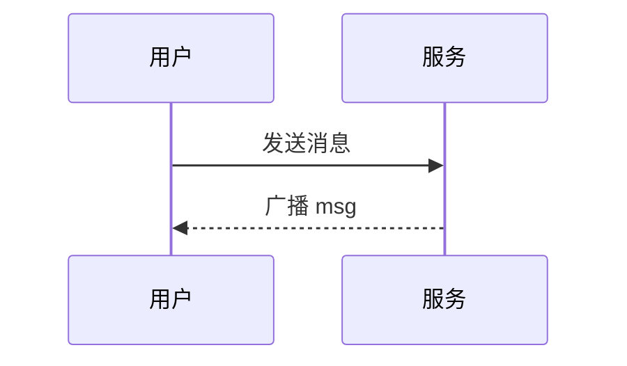

# 消息格式与富文本

CircleChat 的文本消息默认按富文本渲染，支持 Markdown、代码高亮、数学公式和流程图。这一页是给普通用户的格式速查；更完整的收发机制见 [用户指南](../guide/usage.md)。

## Markdown

文本消息按 CommonMark 风格的 Markdown 渲染，常用写法都支持：

- **加粗** `**文字**`、**斜体** `*文字*`、~~删除线~~ `~~文字~~`。
- 标题 `#` / `##` / `###`。
- 无序列表 `-`、有序列表 `1.`。
- 链接 `[文字](https://example.com)`、行内代码 `` `code` ``。
- 引用 `>`、分割线 `---`、表格。

## 代码高亮

用三个反引号包裹代码，并标注语言即可高亮：

````text
```ts
function add(a: number, b: number) {
  return a + b
}
```
````

- 高亮用 [highlight.js](https://github.com/highlightjs/highlight.js)，本地自托管 `public/vendor/highlight.min.js`（约 35 种常见语言），不经过外部 CDN。
- 如果该文件缺失，前端自动降级成纯文本，不会报错。
- 不标语言时按自动识别或纯文本展示。

## 数学公式（MathJax）

行内公式用单个 `$` 包裹，块级公式用 `$$`：

```text
质能方程 $E=mc^2$ 是狭义相对论的核心。

$$
\int_{-\infty}^{\infty} e^{-x^2}\,dx = \sqrt{\pi}
$$
```

公式由 MathJax 在客户端渲染，适合贴推导、统计、算法复杂度等内容。

## 流程图 / 时序图（Mermaid）

用 ` ```mermaid ` 代码块写 Mermaid 图表，客户端渲染成图：

````text

````

支持 Mermaid 的常见图类型（流程图、时序图、类图等）。如果运行环境不支持某个图类型，会回退成代码块展示源码。

## 引用回复

右键 / 长按一条消息选「引用回复」，发送时带上原消息引用，其他人能看到你回复的是哪条、原内容是什么。服务端会校验引用必须同房间且未撤回。

## 合并转发

多选多条消息后可「合并转发」成一条 `merge` 类型消息，对方点开能在查看器里看到原始多条内容。合并转发上限 100 条 / 8000 字符，超过会被拒。

## 消息类型一览

| 类型 | 说明 | 上限 |
| --- | --- | --- |
| `text` | 文本（支持上述富文本） | 4096 字符 |
| `image` | 图片（魔数校验） | 单文件 100MB |
| `file` | 文件 | 单文件 100MB |
| `video` | 视频 | 单文件 100MB |
| `audio` | 音频 | 单文件 100MB |
| `merge` | 合并转发（结构化 JSON） | 100 条 / 8000 字符 |
